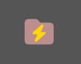
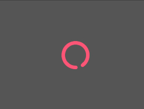
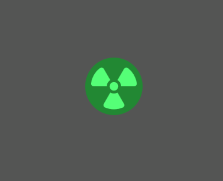
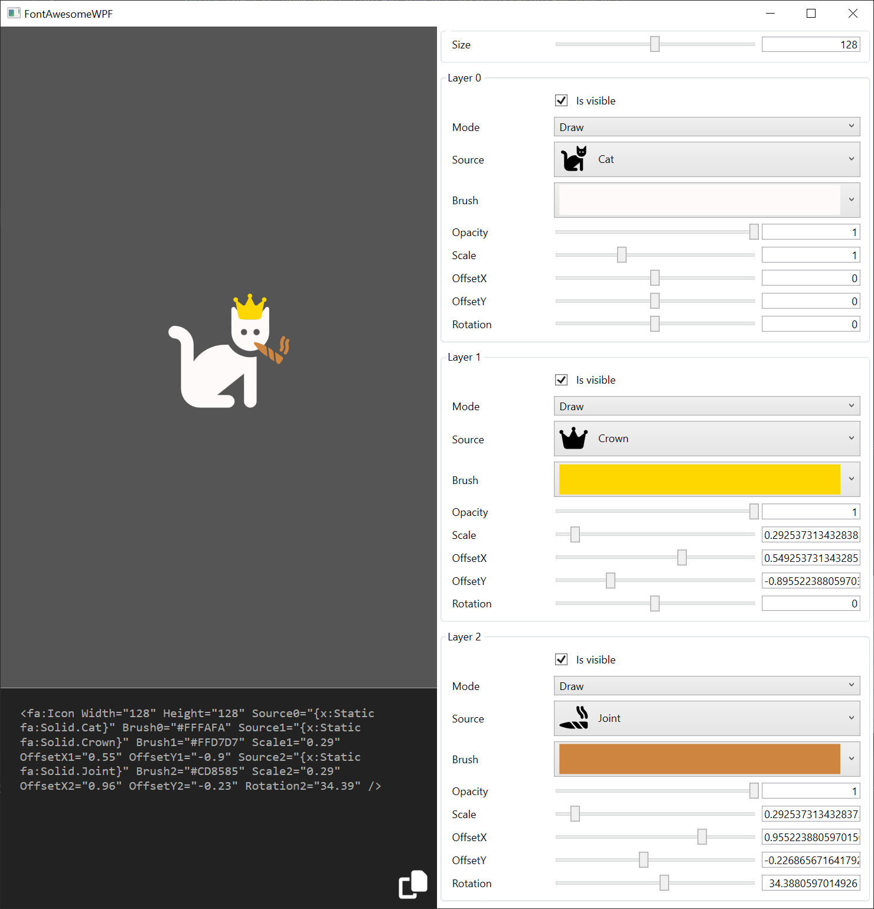

# FontAwesomeWPF

Simple library to bring FontAwesome icons in your WPF application.

Font Awesome version : 6.4.0 Free

# Usage

Install the nuget package _NicolasRepiquet.FontAwesomeWPF_.

Add the namespace to your _XAML_ file, and use the _Icon_ control.


````xml

<Window xmlns:fa="clr-namespace:FontAwesomeWPF;assembly=FontAwesomeWPF"/>

    <fa:Icon Source0="{x:Static fa:Solid.Cat}" Brush0="#ffaa00">

</Window>
````

# Examples

## Basic icon

In its simplest form, you only need to define the source and brush on a layer:

````xml
<fa:Icon Source0="{x:Static fa:Solid.Flag}" Brush0="#FA8072" />
````


## Layers

You can use the multiple layers to stack icons on top of each other :

````xml
<fa:Icon Source0="{x:Static fa:Solid.Folder}" Brush0="#BC8F8F" Source1="{x:Static fa:Solid.Bolt}" Brush1="#FFD700" Scale1="0.6" OffsetY1="0.1" />
````




## Mask

The "mask" mode can be used to create negative space :

````xml
<fa:Icon Source0="{x:Static fa:Solid.Circle}" Brush0="#00FF7F" Source1="{x:Static fa:Solid.Star}" Mode1="Mask" Scale1="0.7" />
````


## Animation

Of course you can animate any of the properties to achive cool effects.

### Spinner

````xml
<Window.Resources>
    <Style x:Key="Spinner" TargetType="{x:Type fa:Icon}">
        <Style.Triggers>
            <EventTrigger RoutedEvent="Loaded">
                <BeginStoryboard>
                    <Storyboard>
                        <DoubleAnimation Storyboard.TargetProperty="Rotation0"
                                         From="0" To="360" RepeatBehavior="Forever"/>
                    </Storyboard>
                </BeginStoryboard>
            </EventTrigger>
        </Style.Triggers>
    </Style>
</Window.Resources>

<fa:Icon Style="{StaticResource Spinner}" Source0="{x:Static fa:Solid.CircleNotch}" Brush0="#FF5577"/>
````




### Hover

````xml
<Window.Resources>
    <Style x:Key="Hover" TargetType="{x:Type fa:Icon}">
        <Style.Triggers>
            <Trigger Property="IsMouseOver" Value="True">
                <Trigger.EnterActions>
                    <BeginStoryboard>
                        <Storyboard>
                            <DoubleAnimation Storyboard.TargetProperty="Scale1" From="0.8" To="2" Duration="0:0:0.500">
                                <DoubleAnimation.EasingFunction>
                                    <ElasticEase Oscillations="5" Springiness="0.5"/>
                                </DoubleAnimation.EasingFunction>
                            </DoubleAnimation>
                        </Storyboard>
                    </BeginStoryboard>                                                
                </Trigger.EnterActions>
                <Trigger.ExitActions>
                    <BeginStoryboard>
                        <Storyboard>
                            <DoubleAnimation Storyboard.TargetProperty="Scale1" To="0.8" Duration="0:0:0.200"/>
                            <DoubleAnimation Storyboard.TargetProperty="Rotation1" From="0" To="360" Duration="0:0:0.500"/>
                        </Storyboard>
                    </BeginStoryboard>                                                
                </Trigger.ExitActions>
            </Trigger>
        </Style.Triggers>
    </Style>
</Window.Resources>

<fa:Icon Width="64" Height="64" Style="{StaticResource Hover}" 
            Source0="{x:Static fa:Solid.Circle}" Brush0="#228833"
            Source1="{x:Static fa:Solid.Radiation}" Brush1="#55FF77" Scale1="0.8"/>
````



# How does it works

The _Icon_ control contains three optional layers. Each of these layer can be used to show a FontAwesome icon.

The way the layer is shown is controlled by various properties (replace I with the layer index [0..2]) :

| Name       | Type       | Description                          |
|------------|------------|--------------------------------------|
| IsVisibleI  | bool       | Show or hide the layer               |
| ModeI       | LayerMode  | Layer can be drawn or used as a mask |
| SourceI     | IconSource | Geometry to use for this layer       |
| BrushI      | Brush      | Brush used to fill the geometry      |
| PenI        | Pen        | Pen used to stroke the geometry      |
| OpacityI    | double     | [0..1] Opacity of the layer          |
| ScaleI      | double     | Factor to scale the geometry with    |
| OffsetXI    | double     | Add an horizontal offset to the layer. 1 unit = 1/2 of the icon width |
| OffsetYI    | double     | Add a vertical offset to the layer. 1 unit = 1/2 of the icon height   |
| RotationI   | double     | Rotate the geometry (in degree) |


# Test

The sources also contains a small application (_FontAwesomeWPF.Test_) to play with the various settings:

